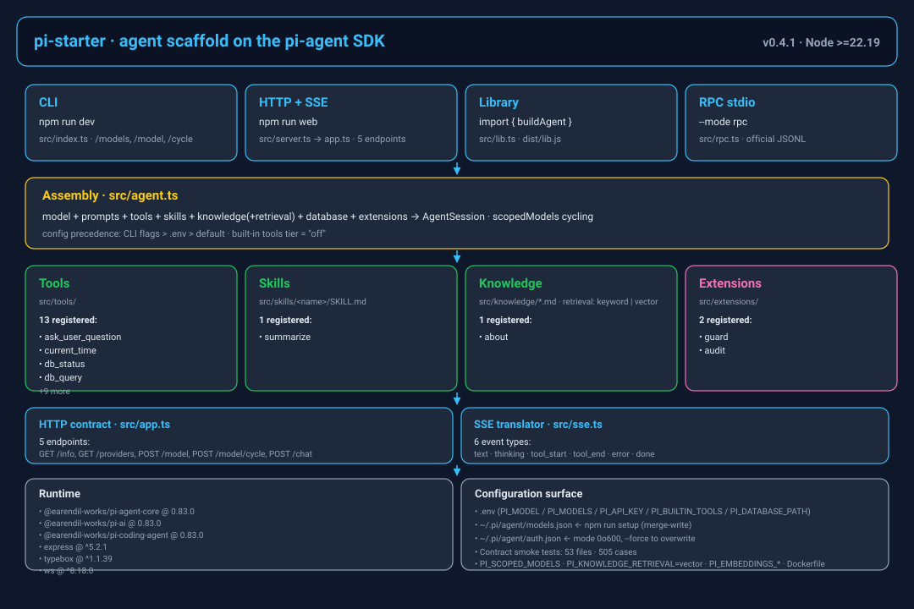
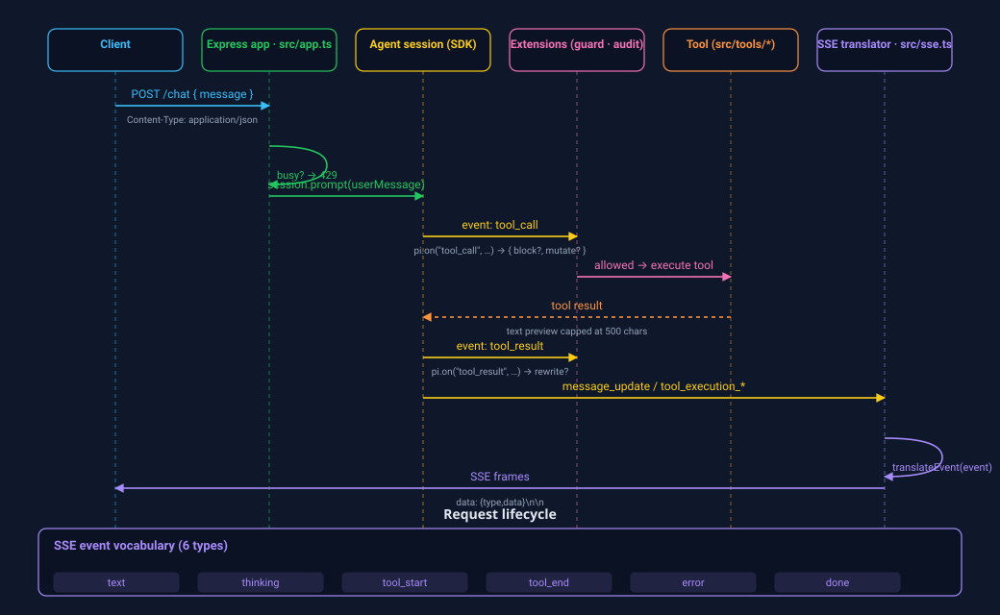
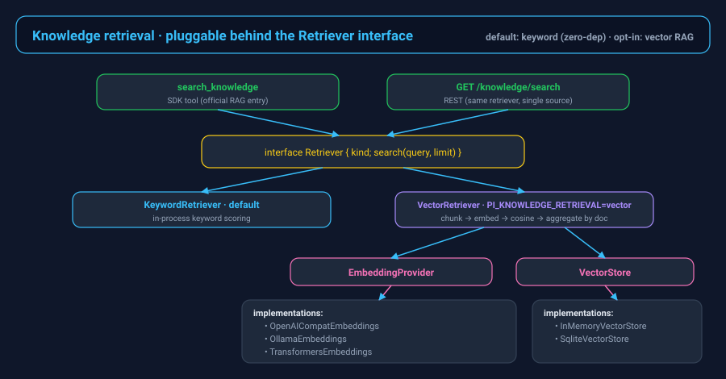

# π-starter

**中文** | [English](README.md)

<p>
  <a href="https://github.com/LPK3215/pi-starter/releases"></a>
  <a href="LICENSE"></a>
  <a href="https://nodejs.org/"></a>
  <a href="https://github.com/LPK3215/pi-starter/actions/workflows/ci.yml"></a>
  <a href="https://github.com/LPK3215/pi-starter/issues"></a>
  <a href="https://github.com/LPK3215/pi-starter/commits/main"></a>
  <a href="CONTRIBUTING.md"></a>
</p>

**仓库地址**：<https://github.com/LPK3215/pi-starter> · **上游 SDK**：[earendil-works/pi](https://github.com/earendil-works/pi)

基于 [pi-agent](https://github.com/earendil-works/pi) SDK 的 **Agent 脚手架**：拿到就能跑，往上加工具、加扩展、改人设，就变成一个垂直 Agent。

## 架构总览

<p align="center">
  
</p>

*脚手架分层视图。从上到下：入口（CLI / HTTP + SSE / 库 / 官方 RPC）→ `src/agent.ts` 组装层 → 业务资源（工具 / 技能 / 知识库+检索 / 扩展）→ HTTP 契约与 SSE 翻译 → 运行时依赖与配置面。图中所有计数、模块名、版本与事件名都由 [`scripts/visualization/`](scripts/visualization/README.md) 下的脚本在生成时从源码里读。*

每次 `POST /chat` 都走同一条链路：HTTP 体→忙碌闸门→`session.prompt`→`tool_call` 钩子（扩展链，例如 `guard`）→工具执行→`tool_result` 钩子（例如 `audit`）→SDK 事件→`translateEvent()`→SSE 帧回到客户端。

<p align="center">
  
</p>

*时序图由 [`scripts/visualization/generate_request_flow.mjs`](scripts/visualization/generate_request_flow.mjs) 生成。事件词表（`text`、`thinking`、`tool_start`、`tool_end`、`done`、`error`）与工具结果预览上限都从 [`src/sse.ts`](src/sse.ts) 和 [`src/app.ts`](src/app.ts) 里读，不写死。*

<!-- TODO: 截图待补充 — CLI 会话示例与 web/ 前端浏览器截图 -->

## 技术栈

| 层级 | 库 / 运行时 | 版本 | 说明 |
|---|---|---|---|
| 语言 | TypeScript | `^5.6.0` | `strict: true`、`module: NodeNext`、`target: ES2022` |
| 运行时 | Node.js | `>=22.19` | 需要内置 `node:sqlite` |
| 模块体系 | ESM | `"type": "module"` | 构建产物在 `dist/`，对外 `import "pi-starter"` |
| Agent SDK | [`@earendil-works/pi-agent-core`](https://github.com/earendil-works/pi) | `0.83.0` | 钉版本 |
| AI 适配 | [`@earendil-works/pi-ai`](https://github.com/earendil-works/pi) | `0.83.0` | 钉版本 |
| Coding Agent | [`@earendil-works/pi-coding-agent`](https://github.com/earendil-works/pi) | `0.83.0` | 工具 / 扩展契约 |
| HTTP | [Express](https://expressjs.com/) | `^5.2.1` | 单进程；Web 端每连接多对话并发 |
| Schema | [TypeBox](https://www.npmjs.com/package/typebox) | `^1.1.39` | 工具 `parameters` 定义 |
| WebSocket | [ws](https://www.npmjs.com/package/ws) | `^8.18.0` | 快照驱动的双向传输（`transport/ws.ts`） |
| 测试 | Node 内置 test runner，走 `tsx --test` | `^4.22.4` | 37 个测试文件 · 308 用例，不调模型 |
| 构建 | `tsc -p tsconfig.build.json` + `scripts/dist-assets.cjs` | `^5.6.0` | 把 `prompts/`、`skills/`、`prompt-templates/`、`knowledge/` 拷到 `dist/` |

上面这张表的单一真源是 [`package.json`](package.json)。版本变更时，代码与本表同步；架构 SVG 自动刷新（`node scripts/visualization/generate_architecture.mjs`）。

## 特性

- **三入口**：CLI（`npm run dev`）+ HTTP SSE（`npm run web`）+ 官方 RPC stdio JSONL（`npm run dev -- --mode rpc`，跨语言 / 子进程集成）。后端接口是产品；[`web/`](web) 里是一个 React 前端，在浏览器里说同一套 WS 协议
- **分层提示词**：`src/prompts/` 下 `persona.md`（人设）+ `rules.md`（规则），改文件即改性格
- **工具即插即用**：`src/tools/` 下定义，`tools/index.ts` 登记，自动注册进 Agent
- **技能管理**：`src/skills/<name>/SKILL.md`，走 SDK `DefaultResourceLoader.additionalSkillPaths`，目录由 `formatSkillsForPrompt` 注入，全文用内置 `read` 按 `<location>` 加载
- **知识库**：`src/knowledge/*.md`，系统提示词只放目录，正文由 `search_knowledge` / `read_knowledge` 按需取（SDK 没有原生知识库）。检索后端在 `Retriever` 接口下可插拔：默认关键词（零依赖、行为不变），设 `PI_KNOWLEDGE_RETRIEVAL=vector` + OpenAI 兼容/Ollama embeddings 端点即切换为向量 RAG；以后实现 `VectorStore`（Qdrant/pgvector）可无缝插入，工具契约不变。
- **提示词模板**：`src/prompt-templates/<name>.md` 就是 SDK 的斜杠命令模板——`session.prompt("/name")` 会展开成完整正文再发（支持位置参数 `$1`、`$@`、默认值 `${1:-x}`）；走 `additionalPromptTemplatePaths` 加载，`~/.pi` 扫描关闭
- **数据库**：Node 内置 `node:sqlite`，默认内存库 + 示例 `notes`；`GET /db` 探活，`db_query` 只读查询
- **扩展机制**：`src/extensions/` 下用 `pi.on()` 挂钩子。已带 `guard`（执行前拦截）和 `audit`（耗时日志）
- **一键写入 Pi 原生配置**：`npm run setup` merge 进 `~/.pi/agent/models.json` + `auth.json`，运行时不加兼容层
- **模型目录可配置、可切换**：`.env` 的 `PI_MODELS` 声明多个 provider 和模型，`PI_MODEL` 选默认；CLI 用 `/model`，HTTP 用 `POST /model`，都在当前会话里切换，不重建
- **内置工具默认关编码能力**：`off` 只开自定义工具 + `read`（技能加载需要它）；bash/edit/write 要显式打开
- **库导出**：`npm run build` 后可 `import { buildAgent, createApp } from "pi-starter"`，业务从参数注入，不必改脚手架源码

## 默认能力

脚手架默认是 **垂直 Agent 起点**，不是再包一层编码助手。clone 下来时：

| 有 | 没有（除非你打开） |
|---|---|
| `src/tools/` 里登记的自定义工具（现成示例：`current_time`） | SDK 内置 `bash` / `edit` / `write`（`off` 仍开 `read`，给技能用） |
| `src/skills/` 走 SDK `additionalSkillPaths`，全文用内置 `read` | 本机 `~/.pi/agent/skills`、Claude Code / Codex 技能目录 |
| `src/knowledge/` 知识库 + `search_knowledge` / `read_knowledge` | 向量库 / 外部 RAG |
| `src/prompt-templates/<name>.md` 走 SDK `additionalPromptTemplatePaths`（`/name` 展开） | 全局 `~/.pi/agent/prompts` 与项目 `.pi/prompts` 的扫描 |
| 内存 SQLite + `GET /db` / `db_query` | 远程 Postgres / 连接池（自己注入 `database`） |
| `persona.md` + `rules.md` 系统提示词 | `~/.pi/agent/extensions` 和 `<cwd>/.pi/extensions` 里的文件扩展 |
| `guard` 拦截危险 bash、路径越出 cwd（`read SKILL.md` 例外） | 完整沙箱 / 容器隔离 |
| `audit` 打印工具耗时 | 登录、多用户会话、公网暴露 |
| 快照驱动的 WebSocket（重启 / 重连自愈、背压丢快照、超慢客户端断开） | 跨客户端对话过户 |
| 会话可改名、回退、编辑用户消息、按路径分叉（调用 SDK 会话树，重启后仍在），也可**真删除**（`delete_conversation`：索引条目 + 会话文件一起没，删前过与打开时同一道路径白名单） | 目标审查循环。SDK 没有这个工作流 |
| 多对话并发（上限 8 + LRU）、会话 / 设置 / 规则落盘 | 目标审查循环、审查委派、SCM、后台任务跟踪 |
| 工具看门狗（挂死工具不永久阻塞）、审批规则引擎（六种匹配器 + 编辑接口） | 插件市场 |
| 计划模式（会话级只规划不实施）、子代理、MCP 桥（stdio + 热生效） | 交互式 PTY（vim / top）、附件与视觉桥 |
| `coding` 档的进程执行：`exec` / `exec_jobs` / `exec_stop`（超时、进程树、工作区 realpath） | 默认就开 shell。`off` / `readonly` 没有 `exec` |
| 多把 API 密钥（原始值永不出服务端）、类型化错误、限流、指标、脱敏日志 | OAuth、多用户、支付 |

打开内置工具（优先级：命令行 > `.env` > 默认 `off`）：

```bash
# .env
PI_BUILTIN_TOOLS=off        # 默认：自定义工具 + read（技能加载）
# PI_BUILTIN_TOOLS=readonly # 再加上 grep / find / ls
# PI_BUILTIN_TOOLS=coding   # 再加上 bash / edit / write，以及 exec / exec_jobs / exec_stop

# 或临时覆盖
npm run dev -- --builtin-tools coding
```

`readonly` / `coding` 走 SDK allowlist，自定义工具名会自动并进去。工具必须出现在 `src/tools/index.ts` 或 `buildAgent({ extraTools })` 里；只在扩展里 `pi.registerTool` 的名字不会自动放行。

打开 `coding` 之后，`guard` 才会真正拦到 bash / exec / write：危险命令（如 `rm -rf`）和越出工作目录的路径会被 `{ block: true }`。`exec` 是进程执行（拿输出、后台任务），不是交互式终端。改规则去 `src/extensions/guard.ts`。

## 快速开始

### 0. 前置条件

- Node.js ≥ 22.19
- 一个 ModelScope token（或你要换成的其他 OpenAI 兼容供应商的 Key）

### 1. 安装并写入 Pi 配置

```bash
npm install
cp .env.example .env   # Windows: copy .env.example .env
# 编辑 .env，填 PI_API_KEY
npm run setup
```

`setup` 会 **merge**（不覆盖其他 provider）写入 Pi 原生路径：

- `~/.pi/agent/models.json` — ModelScope 的 `baseUrl` + 模型 id
- `~/.pi/agent/auth.json` — `{ "modelscope": { "type": "api_key", "key": "..." } }`（文件 mode 0o600）

已有该 provider 的密钥默认保留。覆盖才加 `--force`：

```bash
npm run setup -- --force
```

运行时仍由 SDK 读这两个文件，项目里的 `PI_API_KEY` 只给 setup 用，不会在请求路径上再套一层。

`.env` 里要有默认模型，两种写法：

```bash
PI_MODEL=modelscope/deepseek-ai/DeepSeek-V4-Flash-0731
# 或分开写（模型 id 自带斜杠时，斜杠原样保留，不会被当成 provider）
PI_PROVIDER=modelscope
PI_MODEL=deepseek-ai/DeepSeek-V4-Flash-0731
```

缺了会直接抛，**不会**落到 SDK 内置 huggingface。

多个模型写 `PI_MODELS`，一条一个 provider，模型用逗号，显示名用冒号：

```bash
PI_MODELS=modelscope|https://api-inference.modelscope.cn/v1|openai-completions|deepseek-ai/DeepSeek-V4-Flash-0731:DeepSeek-V4-Flash,Qwen/Qwen2.5-72B-Instruct;zhipu|https://open.bigmodel.cn/api/paas/v4|openai-completions|glm-4.5-air:GLM-4.5-Air
```

不写 `PI_MODELS` 时，setup 只用上面那一条，地址走 `PI_BASE_URL`。

优先级：**命令行 `--model` / `--provider` > `.env`**。没有第三档「SDK 自选」。

密钥按 provider 分：默认 provider 用 `PI_API_KEY`，其余用 `PI_API_KEY_<PROVIDER>`（大写，如 `PI_API_KEY_ZHIPU`）。默认模型所在的 provider 没有密钥会直接失败；其他 provider 缺密钥只跳过并提示。

手写 `~/.pi/agent/` 也可以，格式：

```json
{
  "providers": {
    "modelscope": {
      "baseUrl": "https://api-inference.modelscope.cn/v1",
      "api": "openai-completions",
      "models": [
        { "id": "deepseek-ai/DeepSeek-V4-Flash-0731", "name": "DeepSeek-V4-Flash" }
      ]
    }
  }
}
```

```json
{
  "modelscope": { "type": "api_key", "key": "ms-你的Key" }
}
```

- `api`：国内厂商 / OpenAI 兼容用 `openai-completions`，Anthropic 用 `anthropic-messages`
- `baseUrl` **只填到 `/v1`**，别带 `/chat/completions`

### 2. CLI 对话

```bash
npm run dev
# 临时换默认模型：
npm run dev -- --model zhipu/glm-4.5-air
# 会话中切换（不发给模型）：
#   /models
#   /model modelscope/Qwen/Qwen2.5-72B-Instruct
#   /cycle   # 沿 scopedModels 轮换下一个

# 官方 RPC 模式（stdio JSONL），跨语言 / 子进程集成：
npm run dev -- --mode rpc
```

### 3. HTTP 接口（后端）

```bash
npm run web
# 默认 http://localhost:3000
```

仓库同时自带一个产品前端 [`web/`](web)——独立 npm 项目（Vite + React + [assistant-ui](https://www.assistant-ui.com)），唯一需要手写的就是一层跑在 `/ws` 上的 `ExternalStoreRuntime` 适配。它直接复用 `src/protocol.ts`，线协议类型前后端只有一份。

```bash
npm run ui:dev     # Vite dev 服务跑在 :5173，/ws 代理到后端（:3000）
npm run ui:build   # 产出 web/dist——之后 `npm run web` 直接把应用挂在 /，单进程部署
```

开发模式下代理必须透传原始 `Host`：后端做了同源权威校验（`src/transport/ws.ts` 的 `originAllowed`），给 Vite 代理加 `changeOrigin` 会把转发 Host 改成后端地址，浏览器的握手因此被 403 拒掉，而不带 `Origin` 的非浏览器客户端却照样能连——这个不对称坑过一回，别再踩。

嵌进已有服务时用 `createApp({ staticDir: false })`，自己挂前端。

`GET /health` 返回当前模型、可用模型列表、技能 / 知识库目录、数据库探活、内置工具档位、是否忙碌。

不调模型也能测资源（虚拟 / 示例数据即可）：

```bash
curl http://localhost:3000/skills
curl http://localhost:3000/skills/summarize
curl http://localhost:3000/knowledge/search?q=切换模型
curl http://localhost:3000/knowledge/about
curl http://localhost:3000/db
curl http://localhost:3000/db/notes
curl -X POST http://localhost:3000/db/query -H "content-type: application/json" -d "{\"sql\":\"SELECT title FROM notes\"}"
```

`POST /model` 切换当前会话的模型，不重建会话：

```json
{ "model": "zhipu/glm-4.5-air" }
```

`POST /chat` 对外暴露的 SSE 接口协议（任何语言可调）：

| 事件 type | data | 含义 |
|---|---|---|
| `text` | `{delta}` | 回答的一段文字 |
| `thinking` | `{delta}` | 思考的一段 |
| `tool_start` | `{id,name,args}` | 工具开始执行 |
| `tool_end` | `{id,name,result,isError}` | 工具执行结束 |
| `done` | `{}` | 彻底结束 |
| `error` | `{message}` | 出错 |

## 项目结构

```
pi-starter/
├── src/
│   ├── index.ts          # CLI 入口（交互对话）
│   ├── server.ts         # Web 入口：解析命令行、listen
│   ├── app.ts            # ★ HTTP 应用：/health /skills /knowledge /db /model /chat
│   ├── lib.ts            # 库导出（buildAgent / createApp / setup）
│   ├── setup.ts          # npm run setup：merge 写入 ~/.pi/agent/
│   ├── agent.ts          # ★ 组装层：模型 + 人设 + 工具 + 扩展 → session
│   ├── config.ts         # 配置层：命令行 / .env / 内置工具档位
│   ├── cli-args.ts       # 命令行 flag 解析（CLI / Web 共用）
│   ├── sse.ts            # Agent 事件 → SSE 协议 / 原始 NDJSON（jsonl）
│   ├── rpc.ts            # 官方 RPC 入口（`npm run dev -- --mode rpc`）
│   ├── prompts/          # 分层提示词（改这里 = 改 Agent 性格）
│   │   ├── persona.md    #   人设：你是谁、你怎么回答
│   │   └── rules.md      #   规则：工作约束
│   ├── tools/            # 工具层：给 LLM 装「手」
│   │   ├── index.ts      #   ★ 静态工具登记入口
│   │   ├── current-time.ts
│   │   ├── knowledge.ts  #   检索 / 读知识库
│   │   └── database.ts   #   db_status / db_query
│   ├── skills/           # 技能：<name>/SKILL.md，SDK additionalSkillPaths
│   │   ├── index.ts
│   │   └── summarize/SKILL.md
│   ├── knowledge/        # 知识库：*.md + 可插拔检索（关键词 | 向量）
│   │   ├── index.ts
│   │   ├── retrieval.ts  # Retriever / EmbeddingProvider / VectorStore 接口
│   │   ├── embeddings.ts # OpenAI 兼容 + Ollama embedding provider
│   │   ├── embeddings-transformers.ts # 进程内 embedding（@huggingface/transformers）
│   │   ├── vector-store-sqlite.ts # 持久化 VectorStore（node:sqlite）
│   │   └── about.md
│   ├── prompt-templates/ # 斜杠命令模板：<name>.md → /<name>，SDK additionalPromptTemplatePaths
│   │   ├── index.ts
│   │   └── review.md
│   ├── db/               # 数据库：node:sqlite，默认内存 + 示例 notes
│   │   └── index.ts
│   └── extensions/       # 扩展层：在 Agent 干活环节挂钩子
│       ├── index.ts      #   ★ 登记入口
│       ├── guard.ts      #   示例：tool_call 拦截（危险 bash / 路径越界）
│       ├── audit.ts      #   示例：工具调用审计日志
│       ├── custom-provider.example.ts # 示例：pi.registerProvider（api-key）
│       ├── example-command.ts         # 示例：pi.registerCommand / sendUserMessage
│       └── sandbox.example.ts         # 示例：工具路由覆盖（隔离接缝）
├── scripts/
│   ├── dist-assets.cjs   # clean / copy 将 prompts+skills+prompt-templates+knowledge 拷到 dist/
│   ├── smoke-ws.mjs      # 真实 WebSocket 冒烟（npm run smoke）
│   ├── verify-embed.mjs  # 嵌入路径自检（已并入 npm run verify）
│   ├── rag-smoke.mjs     # 本地 RAG 实机可选自检（npm run rag:smoke）
│   └── visualization/    # README 图产出脚本（见下）
│       ├── generate_architecture.mjs
│       ├── generate_request_flow.mjs
│       ├── generate_retrieval.mjs
│       └── README.md
├── docs/                 # 架构图（自动生成）+ 指南，两份 README 都引用同一份
│   ├── architecture.svg
│   ├── sse-protocol.svg
│   ├── knowledge-retrieval.svg # 可插拔 RAG 检索管线
│   ├── 能力与边界.md    #   与 SDK 对齐的能力矩阵与边界
│   ├── 项目分析报告.md  #   工程体检报告
│   └── 嵌入指南.md      #   把 Agent 装进已有 Express 服务
├── .github/workflows/
│   └── ci.yml            # typecheck + test + build，矩阵跨 ubuntu / windows / macos
├── web/                  # 产品前端（独立 package.json：Vite + React + assistant-ui）
│   └── src/pi/           #   唯一手写的胶水：WS 客户端 + ExternalStore 适配
├── Dockerfile            # 开箱即用的沙箱镜像（见 SECURITY.md / README 高级模式）
├── LICENSE  README.md  README.zh-CN.md  CONTRIBUTING.md  SECURITY.md
├── CHANGELOG.md  FAQ.md  AUTHORS  .gitignore  .gitattributes
└── package.json  tsconfig.json  tsconfig.build.json  .env.example  .dockerignore
```

契约类冒烟测试（不调模型、不写真实 `~/.pi/agent`）：

```bash
npm test
npm run typecheck
npm run build
```

## 二次开发：业务从接口进来

脚手架负责组装、模型、闸门、HTTP。业务（工具、人设、页面、登录）从外面接，不要改 `node_modules/@earendil-works`。

两种接法：

1. **改这个仓库**：人设改 `src/prompts/`，工具登记进 `src/tools/index.ts`，技能丢进 `src/skills/`，知识库丢进 `src/knowledge/`，扩展登记进 `src/extensions/index.ts`。
2. **当库用**：`npm run build` 后 `import { buildAgent, createApp } from "pi-starter"`，通过参数注入，本仓库保持干净。

```ts
import { buildAgent, createApp } from "pi-starter";

const agent = await buildAgent({
  systemPrompt: "你是客服助手……",
  extraTools: [myTool],
  extraExtensions: [myExtension],
  extraSkillPaths: ["./skills"],
  extraKnowledgeDirs: ["./docs"],
  databasePath: ":memory:",
  inMemory: true,
});
const { app, dispose } = createApp({ agent, staticDir: false });
// 把 app 挂到已有 Express；登录、多用户、前端自己包
```

`extraExtensions` 排在内置 `guard` / `audit` 后面。`createApp({ staticDir: false })` 只暴露接口，前端自己接。技能、知识库和提示词模板同名时仓库内置优先。

### 加一个工具

```ts
import { Type } from "typebox";
import { defineTool } from "@earendil-works/pi-coding-agent";

export const myTool = defineTool({
  name: "my_tool",
  label: "我的工具",
  description: "一句话说明这个工具能干什么（LLM 靠它决定什么时候调）",
  parameters: Type.Object({
    query: Type.String({ description: "参数说明" }),
  }),
  async execute(_id, params: { query: string }) {
    return { content: [{ type: "text", text: `结果是：${params.query}` }], details: {} };
  },
});
```

仓库内开发：登记进 `src/tools/index.ts` 的 `allTools`。当库用：传给 `buildAgent({ extraTools: [myTool] })`。`readonly` / `coding` 档位会把这些名字并进 SDK allowlist。

### 加一个扩展

仓库里已有可运行的拦截示例：`src/extensions/guard.ts`。新扩展照抄那个文件的结构。

```ts
import type { ExtensionAPI } from "@earendil-works/pi-coding-agent";

export function myExtension(pi: ExtensionAPI) {
  pi.on("tool_call", (event) => {
    if (event.toolName === "dangerous_tool") {
      return { block: true, reason: "禁止调用该工具" };
    }
    return undefined;
  });
}
```

仓库内开发：登记进 `src/extensions/index.ts` 的 `allExtensions`。当库用：传给 `buildAgent({ extraExtensions: [myExtension] })`。

### 加一个技能

技能是带 YAML frontmatter 的 `SKILL.md`（[Agent Skills](https://agentskills.io/specification)）。加载走 SDK：`noSkills: true` 关掉本机 `~/.pi` 扫描，`additionalSkillPaths` 只加载仓库 / 你注入的目录。SDK 在系统提示词里写 `<available_skills>`（含 `<location>`），模型用内置 `read` 读全文。

```
src/skills/refund/SKILL.md
```

```md
---
name: refund
description: 处理退款申请。用户说退款、退货、取消订单时使用。
---

# 退款流程

1. 先问订单号
2. 调业务工具查状态
3. 按规则决定是否可退
```

重启后会出现在 `GET /health` / `GET /skills`。模型匹配 description 后会 `read` `<location>` 指向的 SKILL.md。当库用：`buildAgent({ extraSkillPaths: ["/path/to/skills"] })`。

默认不扫 `~/.pi/agent/skills`。`off` 档会打开 `read`（技能加载需要它），但不打开 bash/edit/write。`guard` 对越出 cwd 的路径默认拦截，但放行 `read` SKILL.md。

### 加一篇知识库

```
src/knowledge/pricing.md
```

```md
---
title: 价格表
description: 套餐、单价、计费周期
---

基础版 99 / 月，专业版 299 / 月。
```

重启即可。模型先 `search_knowledge({ query: "专业版多少钱" })`，再 `read_knowledge({ name: "pricing" })`。当库用：`buildAgent({ extraKnowledgeDirs: ["/path/to/docs"] })`。

默认是进程内关键词检索（不是向量库）。RAG 是**可选且可插拔**的：设 `PI_KNOWLEDGE_RETRIEVAL=vector` + embedding 源 `PI_EMBEDDINGS_PROVIDER=openai|ollama|transformers`。`transformers` 是**进程内**跑 `@huggingface/transformers`（首次用自动从 HF Hub 下 ONNX 权重到 `PI_EMBEDDINGS_CACHE_DIR`，不需 Ollama/外部服务；靠懒加载 opt-in，默认仍零依赖）。`search_knowledge` 透明切到 embedding + `VectorStore` cosine（默认内存；`PI_KNOWLEDGE_VECTOR_STORE=sqlite` 用 node:sqlite 持久化，重启不重算）。要用真正的向量库（Qdrant/pgvector），实现 `VectorStore` 并经 `buildAgent({ vectorStore })` 传入，工具侧与模型侧完全不变。这正是官方姿势：SDK 不带 RAG，只让你注册一个可搜索工具（本脚手架已经这么做），检索后端自己选。`@huggingface/transformers` 已列入 **optionalDependencies**（默认会装、原生构建失败不致命，代码仍懒加载）。`npm run rag:smoke` 一键实机验证本地进程内路径；模型主机/原生运行时不可达时会打 `SKIP`（退码 0，不假绿）。

<p align="center">
  
</p>

*检索可插拔管线（图内文字为英文）：`search_knowledge` 工具与 `GET /knowledge/search` 共用同一个 `Retriever`；默认 `KeywordRetriever`（零依赖），`VectorRetriever` 组合 `EmbeddingProvider`（OpenAI 兼容 / Ollama / 进程内 transformers）与 `VectorStore`（内存 / sqlite）。后端类名由 [`scripts/visualization/generate_retrieval.mjs`](scripts/visualization/generate_retrieval.mjs) 从源码读取生成。*

### 加一个提示词模板

提示词模板就是 SDK 的斜杠命令机制：文件名即 `/<name>`，`session.prompt("/name")` 会把模板展开成完整正文再发（支持位置参数 `$1`、`$@` / `$ARGUMENTS`、默认值 `${1:-x}`、切片 `${@:N:L}`）。

```
src/prompt-templates/refund.md
```

```md
---
description: 处理订单 $1 的退款
---
对照退款政策处理订单 $1，再起草回复。附加说明：${2:-无}
```

重启即可：`GET /prompt-templates` 会列出它，发送 `/refund ORD-42` 即展开正文。加载走 SDK 的 `additionalPromptTemplatePaths`；`noPromptTemplates: true` 让 loader 不扫全局 `~/.pi/agent/prompts`（与技能 / 扩展同一隔离规矩）。当库用：`buildAgent({ extraPromptTemplatePaths: ["./prompts"] })`；不要内置示例 `review`：`buildAgent({ builtinPromptTemplates: false })`。

### 接一个数据库

SDK 没有原生数据库。脚手架用 Node 22 的 `node:sqlite`，默认 `:memory:`，启动写入两条 `notes`。`GET /db` 探活，`POST /db/query` 只跑 SELECT。Agent 侧工具是 `db_status` / `db_query`。

```ts
const agent = await buildAgent({
  databasePath: "./data/app.db", // 或 PI_DATABASE_PATH
});
```

换实现：实现 `DatabaseStore`，传 `buildAgent({ database: myStore })`。HTTP 和工具只依赖这个接口。

测试不调模型：

```bash
curl http://localhost:3000/db
curl http://localhost:3000/db/notes
curl -X POST http://localhost:3000/db/query \
  -H "content-type: application/json" \
  -d '{"sql":"SELECT id, title FROM notes"}'
```

### 常用 `pi.on` 事件

| 事件 | 时机 | 能力 |
|---|---|---|
| `tool_call` | 工具执行前 | 拦截 / 改参数 |
| `tool_result` | 工具执行后 | 改返回内容 |
| `context` | 发 LLM 前 | 注入消息（如用户偏好） |
| `input` | 收到用户输入后 | 改写 / 拦截输入 |
| `before_agent_start` | 开跑前 | 改系统提示词 |
| `agent_settled` | 一次 prompt 跑完 | 可靠结束信号 |

完整事件菜单见 pi-agent SDK 上游仓库。

### 接进现有模块 / 自己做前端

后端接口如下。页面以后再生成，现在不要改脚手架里的 HTML。

| 方法 | 路径 | 作用 |
|---|---|---|
| GET | `/health` | 当前模型、可用列表、技能 / 知识库目录、数据库探活、是否忙碌 |
| GET | `/skills` | 技能目录（不调模型） |
| GET | `/skills/:name` | 读 SKILL.md 全文 |
| GET | `/knowledge` | 知识库目录 |
| GET | `/knowledge/search?q=` | 关键词检索 |
| GET | `/knowledge/:name` | 读文档全文 |
| GET | `/prompt-templates` | 提示词模板目录（不调模型） |
| GET | `/prompt-templates/:name` | 读模板全文 |
| GET | `/db` | sqlite 探活 |
| GET | `/db/notes` | 示例表 |
| POST | `/db/query` | `{ "sql": "SELECT …" }`，只读 |
| POST | `/model` | `{ "model": "provider/modelId" }`，当前会话切换 |
| POST | `/model/cycle` | 沿 `scopedModels` 轮换到下一个模型（无 body）；没有轮换列表时 400 |
| GET | `/providers` | 各 provider 的鉴权状态（官方 `ModelRuntime.getProviders`/`checkAuth`；只回 id/name/authorized/来源标签，不回原始 key） |
| POST | `/chat` | `{ "message": "..." }`，响应是 SSE 流；加 `?format=jsonl` 走官方原始 JSON 事件流（一行一个事件，`json.md` 词表） |

嵌进已有 Express 时用 `createApp({ agent, staticDir: false })`，不要再开一个端口。完整装配、鉴权挂法与实测结论见 **[`docs/嵌入指南.md`](docs/嵌入指南.md)**。

⚠️ **鉴权只能挂父应用**：`app.use(auth)` 加在 `createApp()` 之后、或加在 `configure` 里都**无效**——内核路由先注册，中间件排在后面永远命中不到（实测无 token 请求 `/skills` 仍返回 200，等于把 `POST /chat`、`POST /model` 裸奔出去）。正确写法是把内核 app 当子应用挂上去：

```ts
const { app: agentApp } = createApp({ agent, staticDir: false });
const server = express();
server.use("/agent", requireAuth, agentApp); // ✅ 401 / 200 实测通过
server.listen(3000);
```

## 功能边界

脚手架做完这些，其余留给业务：

| 做了 | 刻意不做 |
|---|---|
| 模型目录、启动选模型、运行中切换 | 登录 / 用户体系。本地工具不需要；接到现有系统时用现有鉴权包一层 |
| CLI + HTTP 共用 `buildAgent`；Web 端每连接多对话并发（上限 8 + LRU） | 多用户。`busy` 闸门只作用于共享 session 那条路径 |
| 仓库内技能走 SDK ResourceLoader；知识库 Markdown 检索；sqlite 探活 + 只读查询 | 向量库、外部 RAG、扫本机 `~/.pi/agent/skills` |
| `guard` 拦危险 bash 和越出 cwd 的路径 | 沙箱。正则挡不住命令替换、编码绕过、symlink。要隔离用容器 |
| `noExtensions` / `noSkills` / `noPromptTemplates`，不扫本机扩展、技能与提示词模板 | 公网暴露。**默认只绑 `127.0.0.1` 且无鉴权**；`PI_HOST` 改成非回环地址才会真的暴露，启动时会告警 |
| 默认 `PI_BUILTIN_TOOLS=off` | 打开 `coding` 等于把改磁盘、跑 shell 交给模型 |

为什么默认关编码工具、仍开 `read`：我们**总是**给 `createAgentSession()` 传 `tools`，它会变成 SDK 的 `allowedToolNames` 硬白名单——不传反而会打开 `read` / `bash` / `edit` / `write` 全套。工具清单由 `sessionToolPolicy(档位)` 按 `PI_BUILTIN_TOOLS` 生成（`off` 只给 `read`），bash/edit/write 必须显式打开。

代价是白名单**构造后不可增补**（SDK 没有公开的修改方法，只有 `setActiveToolsByName` 切启用状态），所以运行期新增的工具（MCP）必须**按会话重算**——`resolveToolList()` 刻意在 `createSession` 内部求值，重开会话即生效。清单放在 build 时算一次会让 MCP 工具永远进不去。

另：SDK 只有在工具集含 `read` 时才把技能目录写进系统提示词，模型也用 `read` 加载 SKILL.md——这是官方路径，不另包 `read_skill`。脚手架就依赖这份 SDK 注入的 `<available_skills>`，不再自己拼第二份目录（`{{skills}}` 模板层已移除；为兼容旧模板，该 token 仍渲染为空）。`/skills` 与 `/prompt-templates` 的清单直接取自装载器（`getSkills()` / `getPrompts()`），所以清单与系统提示词 / 斜杠展开实际带的那批不可能再漂移。

为什么不加载本机扩展和技能：用户机器上的 pi 扩展 / 技能可能再次注册 bash/write，或把不相干的工作流塞进这个垂直 Agent。

`guard` 不是沙箱。规则在 `src/extensions/guard.ts`，按业务改 `DANGEROUS_BASH_RULES`。

## 进阶（业务自己决定）

- **登录**：本地桌面 / 本机 CLI 可以没有。接到已有后台时**在父应用上挂**鉴权（见上面「接进现有模块」的 `server.use("/agent", auth, agentApp)`）——不要用 `createApp()` 之后加中间件或 `configure`，那两种都挡不住内核路由。
- **多用户**：每个用户一个 `buildAgent()` + 独立 session；不要共用现在这个 `busy` 标志。
- **打开编码工具**：`PI_BUILTIN_TOOLS=coding` 或 `--builtin-tools coding`。这一档同时打开 `exec` / `exec_jobs` / `exec_stop`。打开后 `guard` 仍会拦截危险 bash / exec 和越出 cwd 的路径。不是交互式 PTY。
- **模型切换**：启动时 `--model provider/modelId`；CLI `/model`；HTTP `POST /model`。只接受已配 Key 的模型，走 `session.setModel`，不重建会话。列列表/切换/换 Key 都走官方 `ModelRuntime`（`getAvailable()` / `setModel()` / `setRuntimeApiKey()`）；自定义的只是一层更宽松的名称解析（`resolveModelRef`），支持带斜杠的模型 id、provider+model 拆开传、裸唯一 id、只认已配 Key 的模型——这些是官方 `resolveCliModel`（CLI 单体解析）盖不到的语义，所以这一段有意保留。
- **自定义 provider**：`setup.ts` 把 provider 写进 `~/.pi/agent/models.json`（官方 custom-models 路径，OpenAI/Anthropic 兼容厂商够用）。要接代理网关、私有端点或自定义鉴权解析，走 SDK 的 `pi.registerProvider(name, config)`——一等参数 `buildAgent({ providers })`，或参照 `src/extensions/custom-provider.example.ts` 经 `extraExtensions` 传入。交互式 OAuth（`/login`、设备码）属 TUI，无头后端**不实现**。
- **模型轮换**：`PI_SCOPED_MODELS`（或 `buildAgent({ scopedModels })`）喂官方 `session.cycleModel`/`cycleThinkingLevel`；由 CLI `/cycle`、`POST /model/cycle`、WS `cycle_model` 触发。缺省用所有已配 Key 的模型派生，不改初始选模。
- **AGENTS.md / 项目上下文（opt-in）**：`buildAgent({ includeAgentsFiles: true })` 取消 `noContextFiles` 隔离，让 SDK 把发现的 AGENTS.md 以 `<project_context>` 追加。默认 false，提示词仍完全自持。
- **代码型命令**：`buildAgent({ commands: { deploy: { description, handler } } })` 走官方 `pi.registerCommand`（与 `.md` prompt templates 并列的代码侧路径）；handler 的 ctx 可 `sendUserMessage`/`waitForIdle`。参见 `src/extensions/example-command.ts`（独立扩展形式）。默认空。
- **工具排除与会话小工具**：`buildAgent({ excludeTools })` 应用官方 `excludeTools` 黑名单（在白名单之后）；`agent.waitForIdle()` / `agent.getThinkingLevel()` 对应 `session.agent.waitForIdle` 与 `session.thinkingLevel`；`cycleModel("backward")` 用官方方向参数。
- **条目标签**：官方 `SessionManager.appendLabelChange`/`getLabel` 经 WS `set_label` 与快照 `labels` 暴露——给转录条目做书签。与回退用的 `pi-starter.tree` 标记不同：标签只用于导航，不防重启叶子漂移。
- **消费 pi packages**：后端保持 `noExtensions` / `noSkills` / `noPromptTemplates` 隔离，不跑 `pi install` / `pi update`（那是 `pi` CLI 的事）。要用某个包的资源，把它的 `skills/`、`prompts/`、`extensions/` 目录经现有注入参数传进来——`extraSkillPaths` / `extraPromptTemplatePaths` / `extraExtensions`，等价于装载器的 `extendResources`。
- **JSON 事件流**：`POST /chat?format=jsonl` 把原始 SDK 事件按 NDJSON 逐行输出（首行 `{"type":"session",...}`，之后一行一个事件），而不是翻译后的 SSE 帧——给自定义 UI / 跨语言的出口，默认关，不动现有 SSE 契约。
- **隔离（官方姿势）**：`guard` 仍是默认软闸门（正则+路径、零依赖、不是沙箱）。官方规定的硬隔离是部署层（docs/containerization.md：Docker / Gondolin micro-VM / OpenShell）或 `pi.registerTool` 工具路由扩展；仓库根目录已备好一份 `Dockerfile`（`docker build -t pi-starter . && docker run -p 127.0.0.1:3000:3000 -v "$HOME/.pi/agent:/home/pi/.pi/agent:ro" pi-starter`），`src/extensions/sandbox.example.ts` 演示那个覆盖机制（把 `bash` 路由出宿主，默认不接线）。服务无鉴权，发布端口一定用 `-p 127.0.0.1:` 只绑本机回环，别暴露公网。
- **技能 / 知识库 / 数据库**：技能丢进 `src/skills/`；知识库丢进 `src/knowledge/`；数据库默认内存，或 `PI_DATABASE_PATH` / `buildAgent({ database })`。要接向量库或远程 SQL，写成工具从 `extraTools` 进来。
- **关掉内置示例内容**：`buildAgent({ builtinKnowledge: false, builtinSkills: false, builtinPromptTemplates: false })`。内置的 `about.md`（一份介绍脚手架自己的文档）、`summarize` 技能与 `review` 提示词模板会进系统提示词 / 斜杠命令菜单，而 `extraKnowledgeDirs` / `extraSkillPaths` / `extraPromptTemplatePaths` 是**叠加不是替换**、内置同名优先——所以这是唯一的关闭入口。当库嵌入别人服务时通常该关掉。
- **自定义 WS 命令**：`attachWebSocket(server, { commands: { my_cmd: defineCommand<{ a: number }>({ handler }) } })`。客户端发 `{type:"my_cmd"}` 即可调用；**未注册的命令会回明确错误帧**，不会静默。内置命令不可被同名覆盖。
- **自定义 HTTP 路由**：`createApp({ configure: (app) => app.get("/biz", ...) })`。**必须用这个钩子**，不要拿到 `app` 之后再加——错误处理器已在其内部挂载，之后加的路由排在它后面，抛出的错不会被翻译（实测会把内部细节返回给客户端）。已经加完了才想起封口，用返回值的 `seal()`。
- **注册资源回收**：`createApp()` / `attachWebSocket()` 的返回值有 `addDisposer(fn)`，`dispose()` / `close()` 时统一回收。扩展里开的定时器、子进程、临时文件都该登记。
- **文件服务**：`createApp({ files: new FileService({ root }) })` 开放 `/files/*`（浏览 / 读 / 写 / 重命名 / 复制 / 删除 / Range 原始内容 / base64 上传），全部限制在 root 内，越界与符号链接逃逸一律拒绝。
- **审批规则编辑**：`createApp({ approvalRules: store })` 开放 `/approval/rules`。改动**立即落盘**。
- **重启后恢复**：`buildAgent({ inMemory: false, sessionDir })` + `createSessionHub(..., allowedSessionRoots)`，重启后本工作区的对话可列出并用 `open_conversation` 打开（只传会话 id，路径只从索引查）。

## 文档导航

| 文件 | 内容 |
|---|---|
| [`README.md`](README.md) | 英文主版（同章节 1∶1 对齐） |
| [`CHANGELOG.md`](CHANGELOG.md) | 版本历史（Keep a Changelog + SemVer） |
| [`CONTRIBUTING.md`](CONTRIBUTING.md) | 开发环境、项目地图、自检命令、提交约定 |
| [`SECURITY.md`](SECURITY.md) | 漏洞报告与内建安全边界 |
| [`FAQ.md`](FAQ.md) | 安装 / 运行时 / 模型切换 / 部署 / 开发 常见问题 |
| **[`docs/能力与边界.md`](docs/能力与边界.md)** | **能力清单、功能边界、与参考项目的取舍理由、复核时钉死的事实** |
| **[`docs/嵌入指南.md`](docs/嵌入指南.md)** | **把 Agent 装进已有 Express 服务：两条路线、鉴权挂法、实测自检清单** |
| [`AUTHORS`](AUTHORS) | 维护者 |
| [`scripts/visualization/README.md`](scripts/visualization/README.md) | 上面两张图的重新生成方式 |

## 贡献

欢迎 PR，开题分支即可。完整流程与自检命令见 [`CONTRIBUTING.md`](CONTRIBUTING.md)。计数、工具、endpoint 或 SSE 事件变化后，记得跑图产出脚本：

```bash
node scripts/visualization/generate_architecture.mjs
node scripts/visualization/generate_request_flow.mjs
```

## 安全

pi-starter 定位 **本地优先** 脚手架。HTTP 服务默认绑 `127.0.0.1`、无鉴权；把 `PI_HOST` 改成非回环地址前请先读 [`SECURITY.md`](SECURITY.md)（启动时会告警）。`guard` 基于正则拦截，不是沙箱。

## 作者

- **LPK3215** · GitHub [@LPK3215](https://github.com/LPK3215) · ✉️ <17538703215@163.com>

完整名单参见 [`AUTHORS`](AUTHORS) 与 [contributors graph](https://github.com/LPK3215/pi-starter/graphs/contributors)。

## 致谢

- [pi-agent SDK](https://github.com/earendil-works/pi)（`@earendil-works/pi-agent-core`、`pi-ai`、`pi-coding-agent`）——本脚手架封装的 Agent 运行时
- [Agent Skills 规范](https://agentskills.io/specification) —— `SKILL.md` 格式
- Node.js 团队——内置 `node:sqlite`（>=22.5），不再需要原生驱动

## 许可

基于 [MIT License](LICENSE) 发布。
